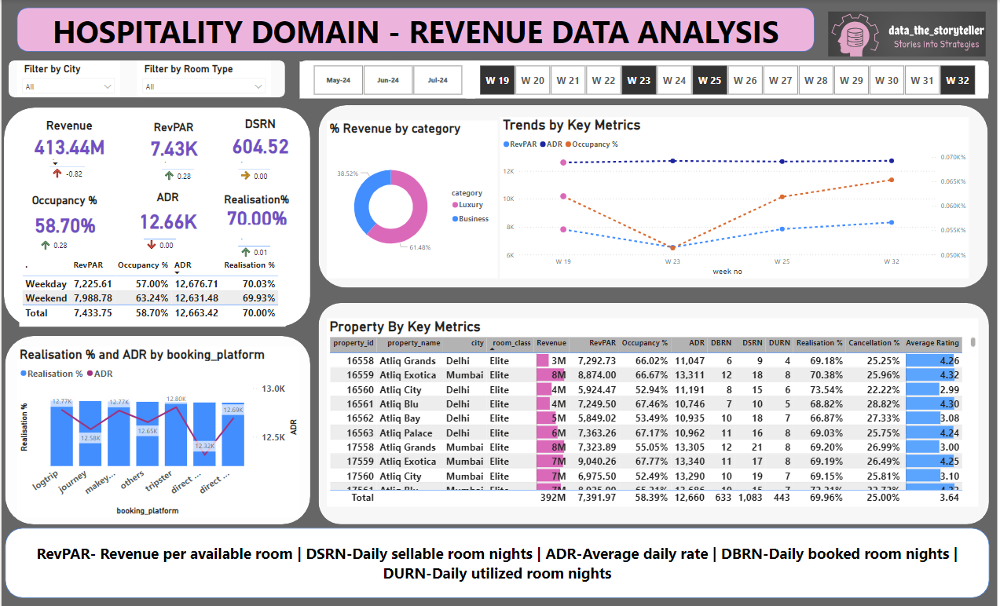

# Hospitality Analysis - PowerBI - Data Analysis and Visualization

## About Problem Statement
Atliq Grands owns multiple five-star hotels across India. They have been in the hospitality industry for the past 20 years. Due to strategic moves from other competitors and ineffective decision-making in management, Atliq Grands are losing its market share and revenue in the luxury/business hotels category. As a strategic move, the managing director of Atliq Grands wanted to incorporate “Business and Data Intelligence” in order to regain their market share and revenue. However, they do not have an in-house data analytics team to provide them with these insights.

Their revenue management team had decided to hire a 3rd party service provider to provide them insights from their historical data.

### This Data anaysis project is a part of the codebasics resume challenge program **.  

## Task List
You are a data analyst who has been provided with sample data and a mock-up dashboard to work on the following task. You can download all relevant documents from the download section.

Create the metrics according to the metric list. Create a dashboard according to the mock-up provided by stakeholders. Create relevant insights that are not provided in the metric list/mock-up dashboard. Provided Mock-up Dashboard

## Skills Learnt -
ETL, Defining Key Metrics and KPI, Exploratory Data Analysis, DAX, Data Analysis, Power Query, Finding Insights, Storytelling through Data, Data Visualization

## Analysis View

## Data Model

## Some Important insights from the Dashboard
AtliQ lost around 298 Million in cancellation

Mumbai generates the highest revenue (669 M) followed by Bangalore, Hyderabad and Delhi

AtliQ Exotica performs better compared to all 7 type of properties with 320 Million revenue, rating 3.62, occupancy percentage 57 and cancellation rate as 24.4%.

AtliQ Bay has the highest occupancy of 66%

Week 24 recorded the highest revenue among all, which is 139.6 Million

Delhi tops both in occupancy and rating followed by Hyderabad, Mumbai, Bangalore

**ADR Stability**: The Average Daily Rate (ADR) has remained consistent, suggesting a stable pricing strategy. However, there is potential to implement dynamic pricing based on demand fluctuations, such as weekends vs. weekdays, to maximize revenue.

**Occupancy Rate**: With a healthy occupancy rate of 57%, AtliQ Grands' properties are effectively utilizing their rooms. There’s an opportunity to boost this rate further, particularly during off-peak periods, to unlock additional revenue potential.

**Guest Satisfaction**: An average guest rating of 3.62 demonstrates a generally positive experience across AtliQ Grands' properties. Maintaining and improving this rating, through proactive customer service and addressing guest feedback, is critical to sustaining success.

## Recommendations:

**Increase Occupancy**: Focus on strategies that drive higher occupancy rates, especially during off-peak times, to optimize room revenue.

**Leverage Late Bookings & Extended Stays**: Encourage guests to make last-minute bookings and extend their stays, offering incentives to generate additional revenue.

**Maximize Weekend Occupancy**: Aim to keep occupancy rates at their peak, especially during weekends when demand is higher.

**Platform Optimization**: Identify platforms with lower booking volumes and increase visibility and engagement to drive more reservations through these channels.

**Improve Guest Ratings**: Address areas of concern that contribute to lower guest ratings, especially in underperforming hotels, with the goal of raising the average rating to between 3.65 and 3.6.

**Address Underperforming Locations**: Focus on properties in cities with ratings below 3, investigating and addressing the root causes to improve both occupancy and guest satisfaction.

**Adopt Dynamic Pricing**: Implement a dynamic pricing model that adjusts rates based on demand patterns. Additionally, consider offering coupons and cashback rewards for direct bookings to increase revenue from the hotel's website and offline channels.